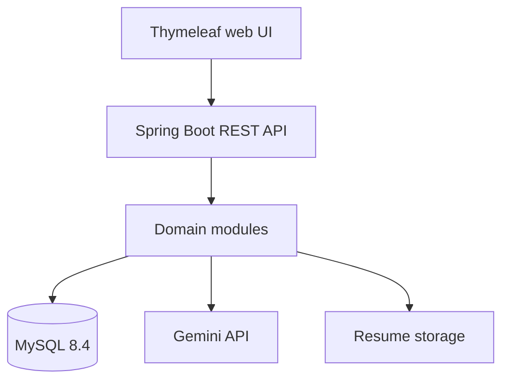

# Architecture and Module Plan

## Technology baseline

| Layer | Choice |
|---|---|
| Backend | Java 17, Spring Boot 4.1.1, Maven |
| API | REST/JSON with versioned `/api/v1` routes |
| Security | Spring Security, JWT access/refresh tokens, BCrypt/Argon2 |
| Persistence | Spring Data JPA, MySQL 8.4 LTS, Flyway |
| AI | Google GenAI Java SDK with Gemini; API key supplied via environment |
| UI | Thymeleaf and Bootstrap 5 for the first release |
| Testing | JUnit 5, Spring Test, H2 for isolated tests |
| Delivery | Docker Compose locally and GitHub Actions CI |

## Logical architecture



The application starts as a modular monolith. Each feature owns its controller, service, repository, entities, and DTOs. This keeps deployment simple while preserving boundaries that can later become independent services.

## Planned package structure

```text
com.sourav.interviewprep
├── auth
├── user
├── resume
├── interview
├── coding
├── analytics
├── admin
├── ai
└── common
    ├── config
    ├── controller
    ├── dto
    ├── exception
    └── security
```

## Module delivery order

| Module | Deliverable |
|---|---|
| 1. Foundation | Requirements, database design, scaffold, MySQL/Flyway, health API, CI |
| 2. Authentication | Registration, login, JWT, refresh/logout, roles, security tests |
| 3. Profile | Candidate profile, skills, target role/company |
| 4. Gemini questions | Prompt templates, structured question generation, retry/error handling |
| 5. Mock interview | Sessions, questions, answers, AI evaluation, scoring |
| 6. Resume analysis | Secure PDF upload, text extraction, ATS analysis |
| 7. Coding practice | Problem catalogue, submissions, isolated runner interface |
| 8. Analytics | Dashboard summaries, trends, recommendations |
| 9. Admin and hardening | Admin APIs, audit, rate limiting, observability, deployment |

## Security boundaries

- Browsers never receive the Gemini key or database credentials.
- Controllers validate input and delegate business rules to services.
- Ownership checks are mandatory for every user-scoped resource.
- Uploaded resumes are private and addressed by opaque storage keys.
- Code execution will run outside the main API process behind a constrained runner interface.
- AI responses are untrusted input and must be schema-validated before persistence.
