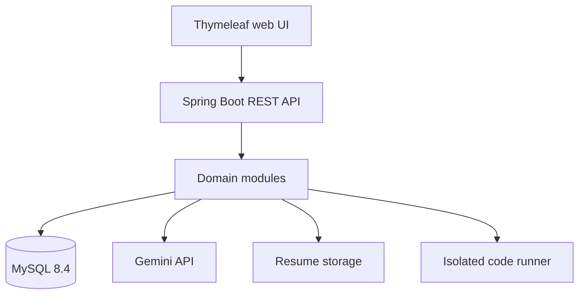

# Architecture and Module Plan

## Technology baseline

| Layer | Choice |
|---|---|
| Backend | Java 17, Spring Boot 4.1.1, Maven |
| API | REST/JSON with versioned `/api/v1` routes |
| Security | Spring Security, JWT access/refresh tokens, BCrypt/Argon2 |
| Persistence | Spring Data JPA, MySQL 8.4 LTS, Flyway |
| AI | Google GenAI Java SDK with Gemini; API key supplied via environment |
| UI | Thymeleaf, semantic HTML, CSS, and same-origin JavaScript modules |
| Testing | JUnit 5, Spring Test, H2 for isolated tests |
| Delivery | Docker Compose locally and GitHub Actions CI |

## Logical architecture



The application starts as a modular monolith. Each feature owns its controller, service, repository, entities, and DTOs. This keeps deployment simple while preserving boundaries that can later become independent services.

## Planned package structure

```text
com.sourav.interviewprep
├── auth
├── user
├── resume
├── interview
├── coding
├── analytics
├── admin
├── ai
└── common
    ├── config
    ├── controller
    ├── dto
    ├── exception
    └── security
```

## Module delivery order

| Module | Deliverable |
|---|---|
| 1. Foundation | Requirements, database design, scaffold, MySQL/Flyway, health API, CI |
| 2. Authentication | Registration, login, JWT, refresh/logout, roles, security tests |
| 3. Profile | Candidate profile, skills, target role/company |
| 4. Gemini questions | Prompt templates, structured question generation, retry/error handling |
| 5. Mock interview | Sessions, questions, answers, AI evaluation, scoring |
| 6. Resume analysis | Secure PDF/DOCX/TXT upload, Apache Tika extraction, Gemini ATS analysis |
| 7. Coding practice | Problem catalogue, submissions, isolated runner interface |
| 8. Analytics | Dashboard summaries, trends, recommendations |
| 9. Admin and hardening | Admin APIs, audit, rate limiting, observability, deployment |

All nine backend modules are implemented. Module 9 adds a dedicated administrator boundary, immutable privileged-operation audit events, request correlation, fixed-window rate limits, Prometheus metrics, health probes, and a non-root container runtime.

The frontend track begins with public landing/authentication pages and an authenticated dashboard shell. Browser refresh tokens are stored only in an HttpOnly SameSite cookie. JavaScript keeps the short-lived access token in memory, restores it through cookie-backed rotation after reload, and never writes either token to local storage.

## Security boundaries

- Browsers never receive the Gemini key or database credentials.
- Controllers validate input and delegate business rules to services.
- Ownership checks are mandatory for every user-scoped resource.
- Uploaded resumes are private and addressed by opaque storage keys.
- Resume bytes and extracted text are size-bounded; list/detail APIs expose analysis metadata, not raw text.
- Resume content and job descriptions are untrusted data inside Gemini prompts.
- Code execution will run outside the main API process behind a constrained runner interface.
- Hidden test cases remain server-side and are sent only to the configured runner.
- The runner must enforce operating-system isolation, resource quotas, outbound-network denial, and per-request timeouts.
- Runner responses are untrusted and must contain a final verdict, exact test counts, non-negative metrics, and a score from 0 to 100.
- Analytics aggregates only owned interview evaluations and coding submissions inside a validated UTC date range.
- Gemini performance advice receives aggregate scores and topic labels only, not resumes, answers, source code, or profile details.
- Saved performance reports are user-owned snapshots and may be refreshed for the same date range.
- AI responses are untrusted input and must be schema-validated before persistence.
- Only access tokens containing `ROLE_ADMIN` can reach administrator or Prometheus routes.
- User suspension revokes all active refresh sessions. Already-issued access JWTs remain valid only for their configured short lifetime.
- Coding-problem deletion is a soft deactivation so historical submissions keep valid foreign keys.
- Rate-limit keys are bounded in memory. Multi-instance production deployments must enforce a shared limit at the gateway or replace the local store with Redis.
- Every response carries a safe correlation identifier, which is included in administrator audit events without logging request bodies or personal data.
