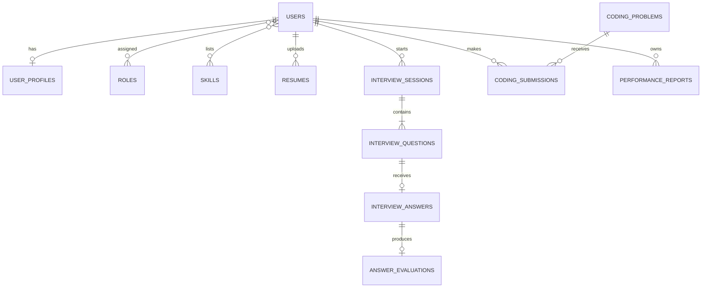

# Database Design

## Entity relationship overview

## Table responsibilities

| Table | Purpose |
|---|---|
| `users` | Identity, password hash, account state and login timestamps |
| `roles`, `user_roles` | Role-based authorization |
| `user_profiles` | Education, experience, target role/company and biography |
| `skills`, `user_skills` | Normalized skill catalogue and candidate proficiency |
| `resumes` | Private file metadata, extracted text, lifecycle state, target role, and Gemini ATS analysis |
| `interview_sessions` | One configured mock interview and its overall result |
| `interview_questions` | Ordered generated or curated questions |
| `interview_answers` | Candidate response and response time |
| `answer_evaluations` | Gemini scores, feedback and ideal answer |
| `coding_problems` | Problem statement, starter code and test cases |
| `coding_submissions` | Source, verdict, performance and score |
| `performance_reports` | Periodic aggregate scores and AI recommendations |

## Design decisions

- Numeric surrogate primary keys keep joins compact.
- Email and other lookup identifiers have unique constraints.
- Child records use foreign keys and intentional cascade rules.
- Flexible AI lists are stored as JSON, while searchable business fields remain relational.
- Scores use `DECIMAL(5,2)` to avoid floating-point rounding surprises.
- Times are persisted in UTC with microsecond precision.
- Flyway owns the schema; JPA uses `ddl-auto=validate` outside tests.

The executable design is the ordered Flyway migration set under `src/main/resources/db/migration`.
